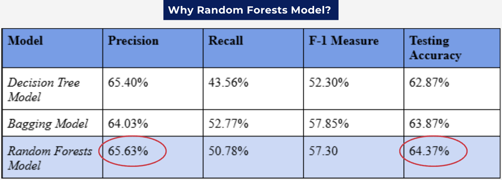

# Analyzing Diabetes Hospital Readmissions  

## Objectives  
- **Enhance patient outcomes and satisfaction** through preventative measures to increase future profits.  
- **Reduce potential penalties** linked to high readmission rates.  
- Leverage **predictive analytics** to identify high-risk diabetic patients for targeted interventions.

## Steps Taken
- Data Preprocessing using Excel to remove significant missing values and impute missing vaues
- Descriptive Analytics initially in R
- Multiple rounds of predictive modeling 

---

## Methods & Approach  
- **Predictive Modeling:**  
  - Implemented a **Random Forest Model** to predict readmission likelihood.
 
  

- **Descriptive Analytics:**  
  - Conducted **Cluster Analysis** to uncover **4 key patient personas** based on behavioral and clinical data.

- **Prescriptive Analytics:**  
  - Developed actionable **recommendations** tailored to each persona, optimizing patient care strategies.  

- **Cost Analysis:**  
  - Designed a **Net Cost Benefit Matrix** to assess the financial impact of implementing recommendations.  

---

## Outcomes  
- **Improved patient segmentation** for targeted care interventions.  
- Combined **analytical insights** with **medical research** to create **specific recommendations** for each patient persona, enhancing the practicality and effectiveness of interventions.  
- Provided actionable insights to **reduce readmission rates** and improve hospital performance.  
- Enhanced data-driven decision-making to **balance patient outcomes with financial goals**.  

---
